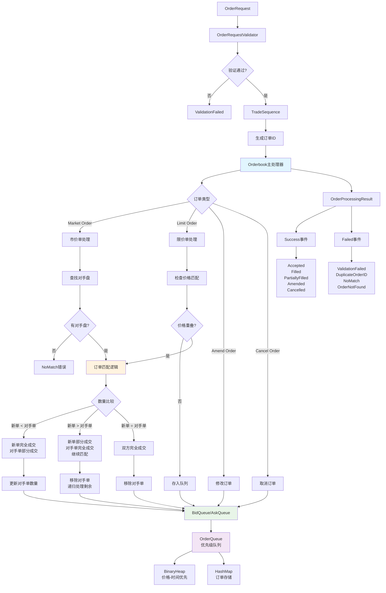

Orderbook原理和逻辑详解
1. 核心概念
Orderbook（订单簿） 是金融交易系统的核心组件，用于管理和匹配买卖订单。它维护两个优先级队列：

Bid Queue（买单队列）：按价格从高到低排序
Ask Queue（卖单队列）：按价格从低到高排序
2. 关键数据结构
OrderQueue 优先级队列

```rust
pub struct OrderQueue<T> {
    idx_queue: Option<BinaryHeap<OrderIndex>>,  // 价格-时间索引
    orders: HashMap<u64, T>,                    // 订单数据存储
    op_counter: u64,                            // 操作计数器
    max_stalled: u64,                           // 最大陈旧索引数
    queue_side: OrderSide,                      // 队列类型(买/卖)
}
```

设计亮点：

使用 BinaryHeap 实现 O(log n) 的插入和删除
分离索引和数据存储，支持高效的订单修改
自动清理陈旧索引，防止内存泄漏
价格-时间优先级算法

```rust
impl Ord for OrderIndex {
    fn cmp(&self, other: &Self) -> Ordering {
        if self.price < other.price {
            match self.order_side {
                OrderSide::Bid => Ordering::Less,      // 买单：价格越高优先级越高
                OrderSide::Ask => Ordering::Greater,   // 卖单：价格越低优先级越高
            }
        } else if self.price > other.price {
            // 相反逻辑
        } else {
            // 价格相同时，时间越早优先级越高 (FIFO)
            other.timestamp.cmp(&self.timestamp)
        }
    }
}
```

3. 订单匹配算法

市价单处理流程
查找对手盘：从对手方队列获取最优价格订单
立即匹配：按对手方价格成交
递归处理：如果部分成交，继续匹配剩余数量
限价单处理流程
价格检查：判断是否与对手盘价格重叠
买单：新单价格 ≥ 最低卖价
卖单：新单价格 ≤ 最高买价
匹配或入队：重叠则立即匹配，否则加入队列
订单匹配逻辑核心

```rust
Copy
fn order_matching(&mut self, ...) -> bool {
    if qty < opposite_order.qty {
        // 新单完全成交，对手单部分成交
        // 更新对手单剩余数量
    } else if qty > opposite_order.qty {
        // 新单部分成交，对手单完全成交
        // 移除对手单，递归处理剩余
        return false; // 表示匹配未完成
    } else {
        // 双方完全成交
        // 移除对手单
    }
    true // 匹配完成
}
```

4. 系统特性

泛型设计

```rust
pub struct Orderbook<Asset>
where Asset: Debug + Clone + Copy + Eq
```

支持任意资产类型（BTC/USD, ETH/USDT等）
编译时类型安全
零成本抽象
事件驱动架构

```rust
pub enum Success {
    Accepted { id: u64, order_type: OrderType, ts: SystemTime },
    Filled { order_id: u64, side: OrderSide, price: f64, qty: f64, ts: SystemTime },
    PartiallyFilled { order_id: u64, side: OrderSide, price: f64, qty: f64, ts: SystemTime },
    Amended { id: u64, price: f64, qty: f64, ts: SystemTime },
    Cancelled { id: u64, ts: SystemTime },
}
```

每个操作都产生详细的事件序列，便于：

审计和合规
实时风控
用户通知
系统监控
订单生命周期管理
ID生成：循环序列生成器，防止ID冲突
验证：资产类型、价格、数量合法性检查
匹配：价格-时间优先级匹配算法
状态管理：支持修改、取消操作
5. 性能优化
内存管理
延迟清理：累积一定数量的陈旧索引后批量清理
容量预分配：避免频繁内存重分配
引用计数：最小化数据复制
算法复杂度
插入订单：O(log n)
匹配订单：O(log n) × 匹配次数
查询最优价格：O(1)
修改/取消：O(log n)
6. 实际应用示例
从测试代码可以看出系统支持的典型场景：

空订单簿处理：市价单无法匹配时返回NoMatch
部分成交：大订单分批匹配多个小订单
价格改善：限价单可能以更优价格成交
价差计算：实时计算买卖价差
7. 系统优势
类型安全：Rust的所有权系统防止数据竞争
内存安全：无垃圾回收的零成本内存管理
高性能：接近C++的性能，优于Java/Python
可扩展：泛型设计支持多种资产类型
可靠性：详细的错误处理和事件报告
这个orderbook实现展现了现代金融系统的核心算法，通过Rust的类型系统和性能特性，提供了一个既安全又高效的交易撮合引擎。

